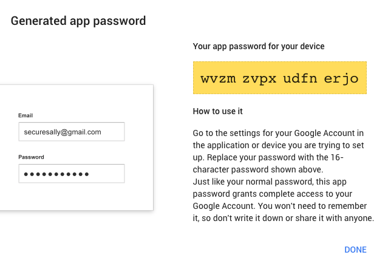

# py-alerts
Simple module/wrapper to send alerts from a python script.

## Setup

Get the code.
```
git clone https://github.com/csteinmetz1/py-alerts.git
```

Install dependenacies.
```
pip install future
pip install requests
```

**Built to work with either Python 2 or Python 3.**

### Email
I reccommend that you create a gmail account just for sending email alerts. Once you have an account tou need to do adjust some settings to send email alerts. 

First enable two-factor authentication [here](https://www.google.com/landing/2step/) for your google alerts account. Next you need to create an app password for your python script to login to your account. You can do that [here](https://myaccount.google.com/u/2/apppasswords) and you should see a window like this:


Now choose `Other` from the `Select app`  dropdown and set a name the name to `py-alerts` (or whatever else you would like) then hit generate. You should then be given a password similiar to the one below.



Note: This isn't a valid passcode - just shown for example.

### Slack

You now have everything you need to start sending email and slack alerts. To set your credentials in python you need to create a JSON config file that contains the info for the gmail account used to send the alerts as well as set the emails of recipients of the alerts. An example is shown below. 

```json
{
	"email" : 
	{
		"gmail_user" : "username@gmail.com",
		"gmail_pass" : "your_app_passcode",
		"gmail_name" : "username",
		"recipients" : ["recipient1@gmail.com", "recipient2@gmail.com"]
	},
	"slack" : 
	{
		"webhook" : "https://hooks.slack.com/services/YOURWEBHOOKURL"
	}
}
```
## Usage
Sending an email in your script is easy. 

``` python
from py_alerts import email_alert

email_alert_obj = email_alert()
my_email_obj.send(subject="This is the subject", message="This is the body of the email")

```
And you should recieve an email shortly after. Ensure that you place the `py_alerts.py` and `settings.json` files in the same directory as the python script you are trying to send emails from. 

``` python
from py_alerts import slack_alert

slack_alert_obj = slack_alert()
my_slack_obj.send(message="This is the message text.")
```